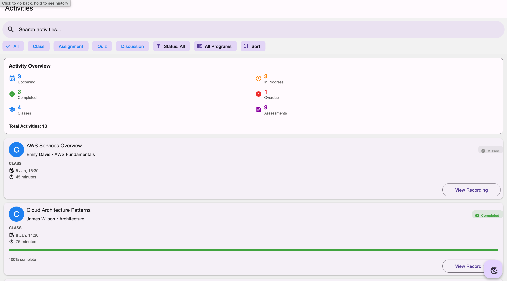
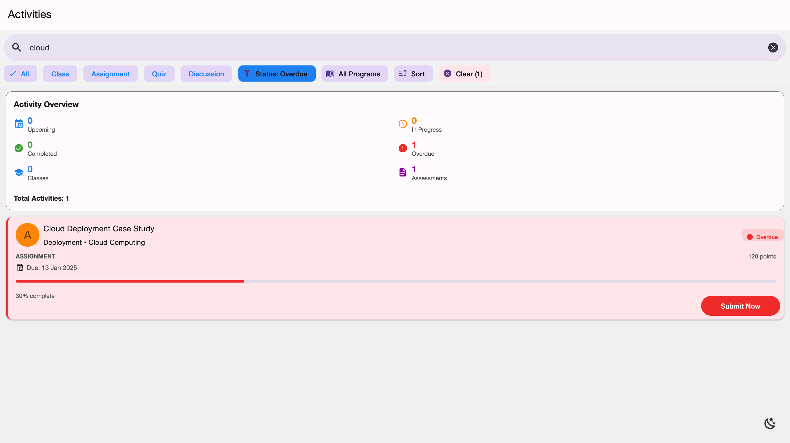
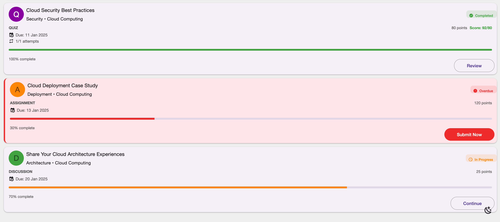
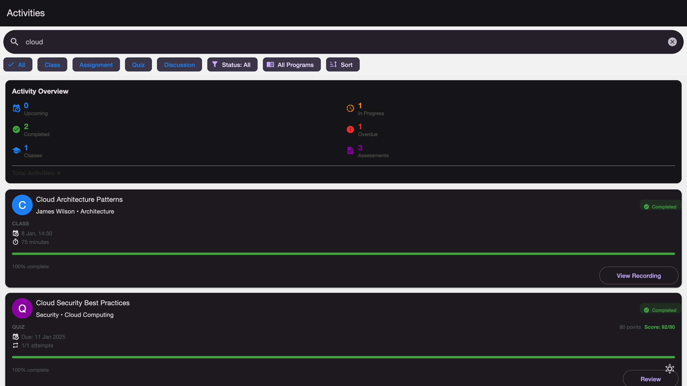
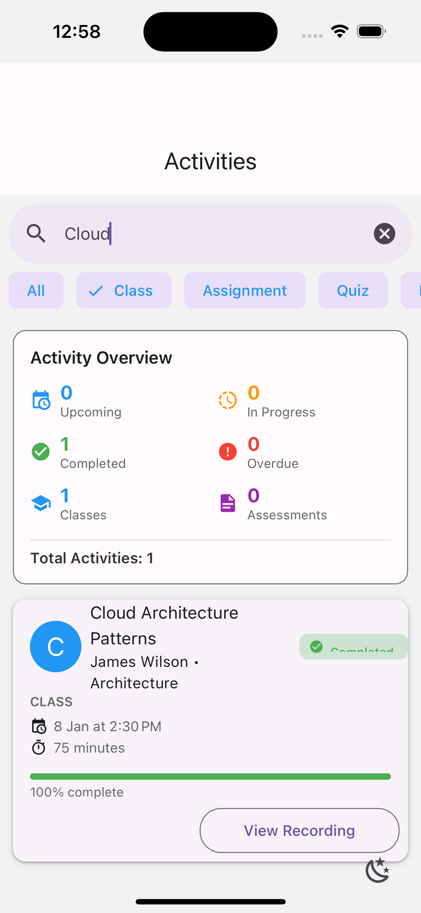
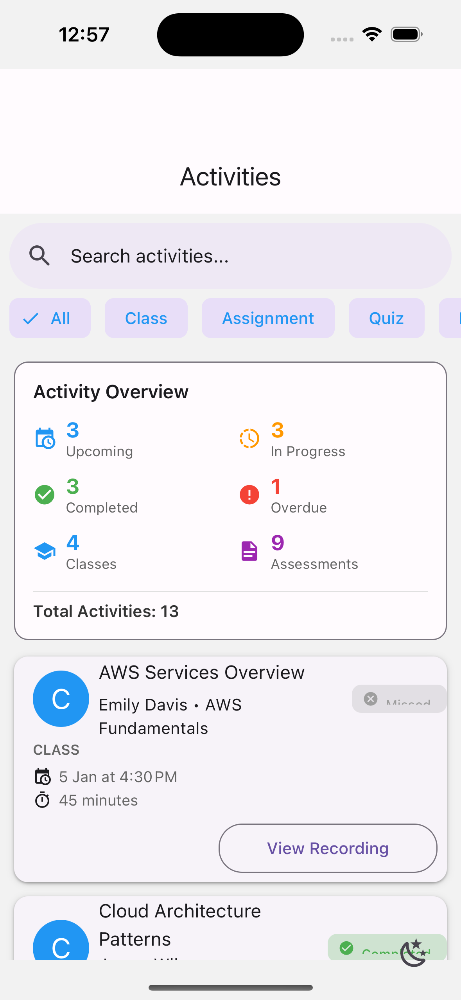
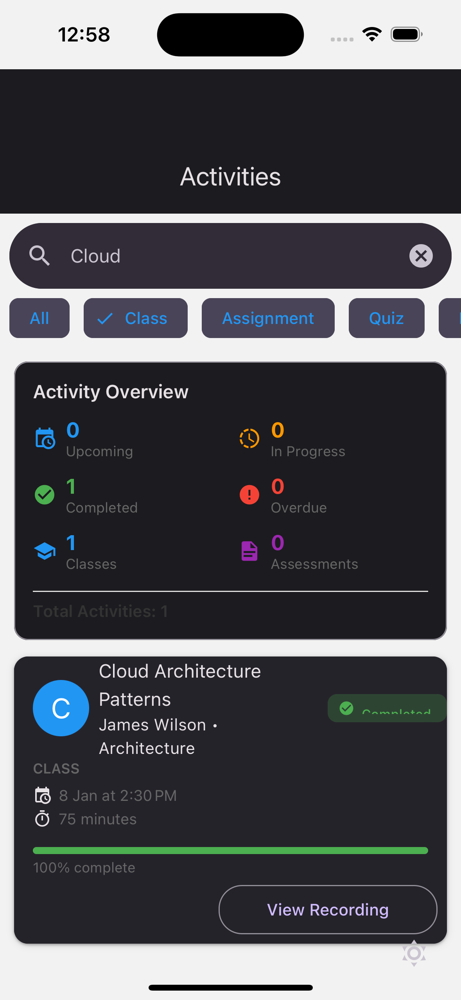

# Activity Listing App

A React Native mobile application for viewing and managing learning activities (classes, assignments, quizzes, and discussions). Built with Expo for cross-platform support.

## Screenshots

### Web Version

#### Main Activity List

*Shows the main screen with all activities, filters, and search bar*

#### Filtering & Search

*Demonstrates filtering by type/status and search functionality*

#### Activity Details

*Shows different activity types (class, assignment, quiz) with status indicators*

#### Dark Mode

*App in dark mode with theme toggle*

### iOS Version

<div style="display: flex; gap: 10px;">
  
  
  
</div>

*iOS app running on simulator showing activity list, details, and dark mode*

## Features

- View list of learning activities with details
- Filter by activity type, status, and program
- Search activities by title, instructor, or module
- Sort by date, status, or type
- Pull-to-refresh to reload activities
- Dark/light theme toggle
- Activity statistics overview

## Tech Stack

| Technology | Purpose |
|------------|----------|
| React Native | Cross-platform mobile development |
| Expo | Development framework and build tooling |
| React Native Paper | UI component library (Material Design) |
| React Navigation | Navigation between screens |
| Axios | HTTP requests for API calls |
| Context API | State management for filters |

## Getting Started

### Prerequisites

- Node.js (v16 or higher)
- npm or yarn

### Installation

1. Clone the repository
   ```bash
   git clone <repository-url>
   cd activity-listing
   ```

2. Install dependencies
   ```bash
   npm install
   ```

3. Start the development server
   ```bash
   npm start
   ```
   
### Running the App

**On Web:**
```bash
npm run web
```

**On iOS Simulator:**
```bash
npm run ios
```

**On Android Emulator:**
```bash
npm run android
```

## Available Scripts

- `npm start` - Start Expo development server
- `npm run web` - Run on web browser
- `npm run ios` - Run on iOS simulator
- `npm run android` - Run on Android emulator
- `npm run mock:api` - Start JSON server for API testing

